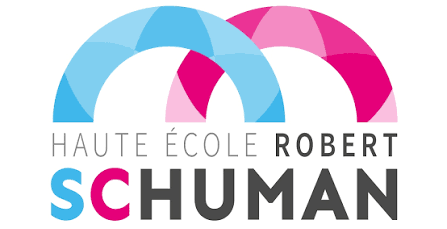

  

  

  
  
  

---

### 📅 Mon activité en 3D

  

---

### 🛠️ Stack technique

**Langages de programmation**

  

**Bases de données**

  

**Web**

  

**Frameworks**

  

**Outils**

  

---

### 📊 Mes stats GitHub

  

---

### 🚀 Projets 

<table>
  <tr>
    <td width="90" align="center">
      
    </td>
    <td>
      <b><a href="https://github.com/HitsuK0/[nom-du-repo-1]">Lexia</a></b> 
      Application de planification des horaires développée dans le cadre d’un projet scolaire réalisé pour l’ASBL Comprendre et Parler.   
      
      
      
    </td>
  </tr>
  <tr>
    <td width="90" align="center">
      
    </td>
    <td>
      <b><a href="https://github.com/HitsuK0/[nom-du-repo-2]">DailyBackup</a></b> 
      Conception et développement d’une application de gestion de sauvegardes, permettant de configurer les fichiers à sauvegarder, restaurer des données et réinitialiser les paramètres.  
      
      
    </td>
  </tr>
  <tr>
    <td width="90" align="center">
      
    </td>
    <td>
      <b><a href="https://github.com/HitsuK0/[nom-du-repo-2]">TaskFlow</a></b> 
      Conception et développement d’une application collaborative de gestion de tâches en temps réel, avec authentification, gestion multi-utilisateurs et synchronisation via WebSocket.   
      
      
      
      
    </td>
  </tr>
</table>

### 🎓 Établissement

  

  <b><a href="https://hers.be/">Haute Ecole Robert Schuman</a></b> 
  Étudiante depuis 2024

---

  

  

